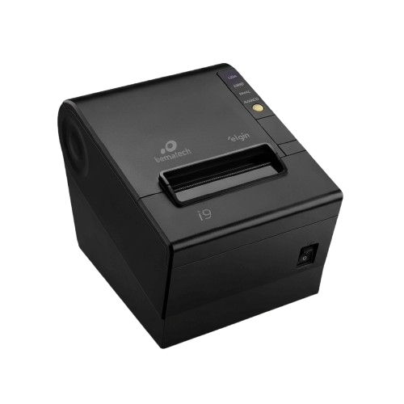
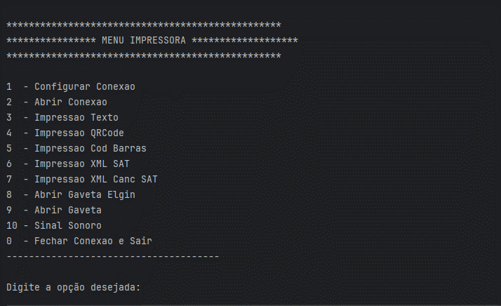

<h1 align="center" >
 
 
 Comunicação Impressora Térmica 🖨️ 

</h1>

### 📕 Sobre o projeto
Desenvolvido como um projeto final de Algoritmos de Programação, esse projeto é uma aplicação de comunicação com **impressoras Térmicas**, seu objetivo é executar impressão de textos, QR Codes, ler arquivos XML para emissão de cupons fiscais, etc.
### 📃 Passo a Passo utilização
- #### Configurar a Conexão com a impressora:
Insira as informações de tipo, modelo, conexao e parametro de conexao;
- #### Conectar com a impressora:
Verifica os parâmetros inseridos na configuração, se baterem, conexão é bem sucedida;
- #### Encerrar conexão com a impressora:
Encerra a conexão atual com a impressora;
- #### Imprimir texto:
Insira os dados a serem impressos, posicão e o estilo e imprime os dados;
- #### Imprimir QR Code:
Insira as informações que vão ser impressas no QR Code, tamanho e o nivel de correção do QR Code;
- #### Imprimir código de barras:
Insira as informações de tipo, dados a serem impressos, altura, largura e HRI;
- #### Emitir sinal sonoro:
Insira a quantidade de sinais a serem emitidos, o tempo de inicio e de fim do sinal sonoro;
- #### Abrir gaveta de dinheiro:
Insira as informações de pino, tempo de inicialização do pulso e desativação do pulso; 
- #### Imprimir XML SAT:
Insira as informações de dados do XML ou o caminho para o arquivo e o parâmetro de qual cupom ser impresso;
- #### Imprimir XML CANCELAMENTO:
Insira as informações de dados do XML ou o caminho para o arquivo, assinatura do QRCode e parâmetro do cupom a ser impresso.  

## Exemplo de configuração e conexão
<h1 align="center" >
 
</h1>

### ⚙️ Funções utilizadas
 - [AbreConexaoImpressora();](https://elgindevelopercommunity.github.io/group___m1.htmlhashtag#ga928f0795631b062f8d5c8c20b9681d8d)   
 Abre conexão com a impressora; 
 
 - [FechaConexaoImpressora();](https://elgindevelopercommunity.github.io/group___m1.htmlhashtag#ga520ec6fa932747f430c2a89bc46c8176)   
 Fecha conexão com impressora;
 - [ImpressaoTexto();](https://elgindevelopercommunity.github.io/group___m1.htmlhashtag#ga6c9bc310ba0f45001cca6420c09e77c7)   
 Envia informações de texto para o buffer da impressora;
 - [Corte();](https://elgindevelopercommunity.github.io/group___m1.htmlhashtag#gab6411e97bf638b98b5acfcc621ec0ade)   
 Realiza o corte do papel;
 - [ImpressaoQRCode();](https://elgindevelopercommunity.github.io/group___m1.htmlhashtag#gace32a45c3d64239fc38f773f199ddf2e)   
 Imprime um QRCode;
 - [ImpressaoCodigoBarras();](https://elgindevelopercommunity.github.io/group___m1.htmlhashtag#ga52b5a949b98c3163709b09762a17e794)   
 Realiza a impressão de código de barras;
 - [AvancaPapel();](https://elgindevelopercommunity.github.io/group___m1.htmlhashtag#ga7bb867ac58bdce583d497d05aa125732)   
 Imprime informações no buffer e avança o papel;
 - [StatusImpressora();](https://elgindevelopercommunity.github.io/group___m1.htmlhashtag#gacd752d6dc3de8bd572757c58baad9abb)   
 Disponibiliza o status de gaveta, tampa, sensor de papel e do ejetor;
 - [AbreGavetaElgin();](https://elgindevelopercommunity.github.io/group___m1.htmlhashtag#ga0477cb1087969802c31407757eb23073)   
 Usa parâmetros padrões para abertura de gavetas Elgin;
 - [AbreGaveta();](https://elgindevelopercommunity.github.io/group___m1.htmlhashtag#ga82f718c7155c604104b0b2fb5e800a40)   
 Abre gavetas de acordo com os parâmetros fornecidos;
 - [SinalSonoro();](https://elgindevelopercommunity.github.io/group___m1.htmlhashtag#gac15aad13ce53d650c10bd74e286170ec)   
 Emite sinal sonoro na impressora;
 - [ModoPagina();](https://elgindevelopercommunity.github.io/group___m1.htmlhashtag#ga7e6a7e1acce3d656659a471fb6dd0458)   
utilizado para dar início aos trabalhos em modo página;

 - [LimpaBufferModoPagina();](https://elgindevelopercommunity.github.io/group___m1.htmlhashtag#gacdc97edd24cfb9903abf0933996112f0)  
 Limpa Buffer em Modo Página;
 - [ImprimeModoPagina();](https://elgindevelopercommunity.github.io/group___m1.htmlhashtag#ga3be49ecd34cd40e445e2bac306d5714c)   
 Imprime no Modo Página;
 - [ModoPadrao();](https://elgindevelopercommunity.github.io/group___m1.htmlhashtag#ga26d6f65fe8192b33fd6df6fa4450d585)   
 Retorna ao Modo Padrão;
 - [PosicaoImpressaoHorizontal();](https://elgindevelopercommunity.github.io/group___m1.htmlhashtag#ga702f50865da261d69afd60618041d6a0)   
 Define Posição de Impressão Horizontal;
 - [PosicaoImpressaoVertical();](https://elgindevelopercommunity.github.io/group___m1.htmlhashtag#ga31c2805a817a8b8049c60c4ac76ae3e7)   
 Define a Posição da Impressão Vertical;
 - [ImprimeXMLSAT();](https://elgindevelopercommunity.github.io/group___m1.htmlhashtag#ga0e73b993587e826d44d95b4f2382e1f0)   
 Recebe o XML de retorno da venda do SAT, valida o conteúdo, constrói o Danfe e realiza a impressão de acordo com a especificação da SEFAZ SP. 
 - [ImprimeXMLCancelamentoSAT();](https://elgindevelopercommunity.github.io/group___m1.htmlhashtag#ga14dad45b993f1f7ca6b99081084a5c12)   
 Recebe o XML de retorno da operação de cancelamento e os dados de assinatura do QRCode de venda, valida as informações, constrói o Danfe e realiza impressão de acordo com a especificação da SEFAZ SP.

### 🔨 Ferramentas utilizadas

### 📚 Bibliotecas:
- import com.sun.jna.Library;
- import java.util.Scanner;
- import javax.swing.JFileChooser;
- import java.io.File;
- import java.io.IOException;
- import java.nio.charset.StandardCharsets;
- import java.io.FileInputStream;
- import java.util.spi.TimeZoneNameProvider;

 ### 🍵 Linguagem:
- Java

### Documentação das Impressoras, bibliotecas, funções:

[Elgin documentação completa](https://elgindevelopercommunity.github.io/group___m1.html)
